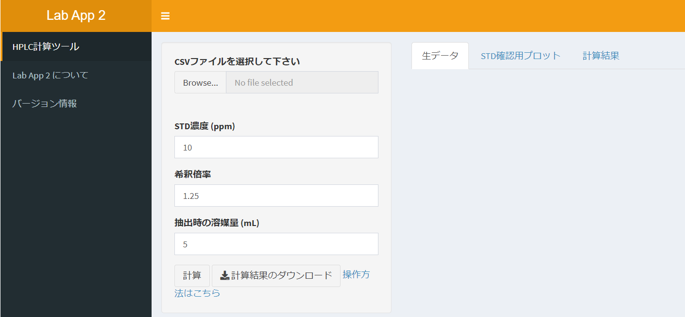
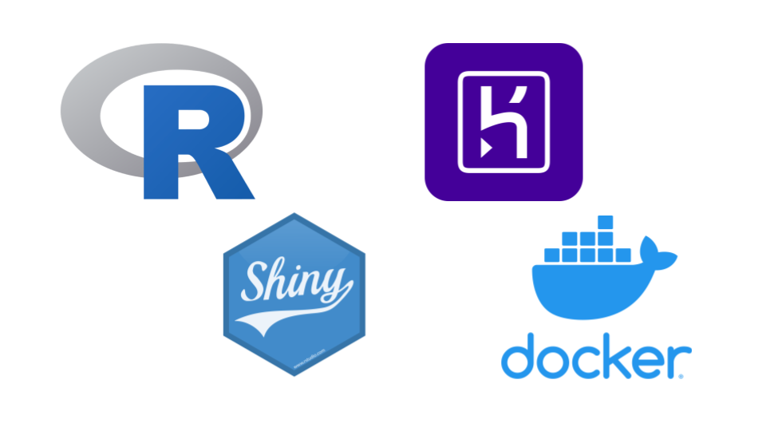

# Lab App 2

1. [App URL](#anchor1)
2. [About](#anchor2)
3. [Technology used](#anchor3)
4. [Steps to run the app in a local environment](#anchor4)
5. [License](#anchor5)

<a id="anchor1"></a>

## App URL
https://lab-app2.herokuapp.com/


<a id="anchor2"></a>

## About
### This App improves work efficiency in the Lab.
No need for cumbersome copy and paste. <br>
No human error and quick calculation.

<a id="anchor3"></a>

## Technology used


- R 4.1.0
- Shiny
- Docker
- Heroku

<a id="anchor4"></a>

## Steps to run the app in a local environment
1. Clone this repository
```bash
git clone https://github.com/tonegawa07/Lab_app_2.git
```

#### By docker
2. build container
```bash
docker build -t lab_app_2 .
```

3. run app
```bash
docker run -p 3838:3838 lab_app_2
```

#### By R
#### In R console
2. install shiny package
```R
install.packages("shiny")
```

3. load package & run app
```R
library(shiny)
runGitHub("Lab_app_2", "tonegawa07", subdir="./app/")
```

<a id="anchor5"></a>

## License
MIT